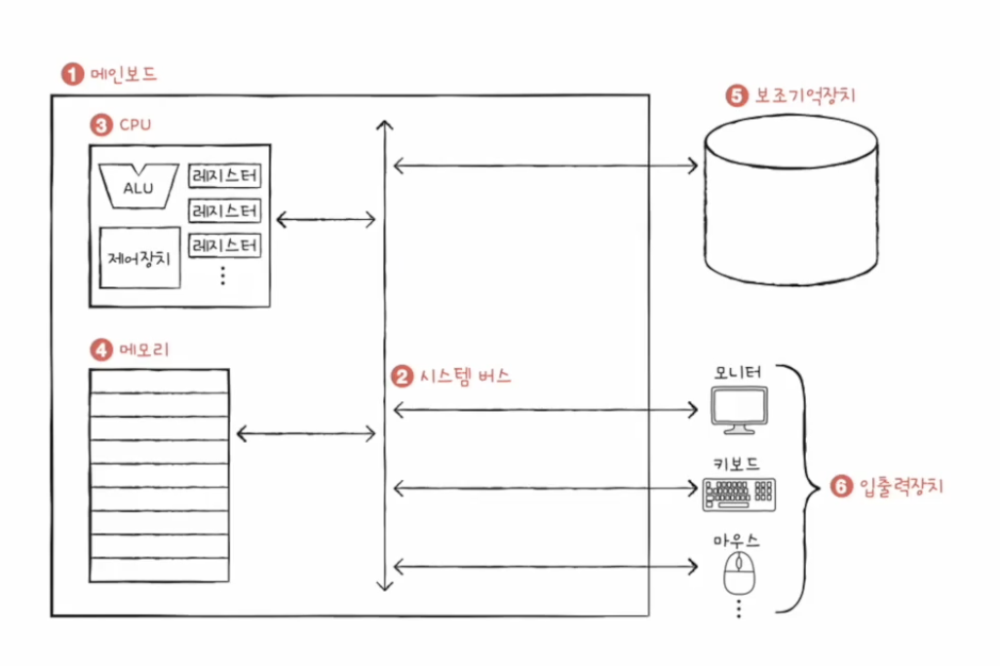

# CH 1. 컴퓨터 구조 시작하기

## 1-1 컴퓨터 구조를 알아야 하는 이유

### 문제 해결

컴퓨터 구조를 이해하고 있다면 개발할 때 문제가 생겼을 시에 문제 상황을 빠르게 진단할 수 있고, 문제해결의 실마리를 다양하게 찾을 수 있다.

### 성능, 용량, 비용

웹 사이트를 구동시킬 서버 컴퓨터 혹은 클라우드 서비스의 성능, 용량, 비용 문제는 프로그래밍 언어의 문법만 알아서는 해결하기 어렵다. 컴퓨터 구조에서 배우는 내용은 결국 성능, 용량, 비용과 직결된다. 즉, 컴퓨터 구조를 이해하면 입력과 출력에만 집중하는 개발을 넘어 성능, 용량, 비용까지 고려하며 개발하는 개발자가 될 수 있다.

## 1-2 컴퓨터 구조의 큰 그림

알아야 할 컴퓨터 구조 지식은 크게 두 가지이다. 하나는 **컴퓨터가 이해하는 정보**이고, 또 하나는 **컴퓨터의 네 가지 핵심 부품**이다.

### 컴퓨터가 이해하는 정보

컴퓨터는 0과 1로 표현된 정보만을 이해한다. 그리고 이렇게 0과 1로 표현되는 정보에는 크게 두 종류가 있는데, 바로 **데이터**와 **명령어**이다.

컴퓨터가 이해하는 숫자, 문자, 이미지, 동영상과 같은 정적인 정보를 가리켜 **데이터**라고 한다. 데이터와 명령어 중 컴퓨터를 실질적으로 작동시키는 더 중요한 정보는 명령어이다. 데이터는 명령어 없이는 아무것도 할 수 없는 정보 덩어리일 뿐이지만, **명령어**는 데이터를 움직이고 컴퓨터를 작동시키는 정보이다. 이런 점에서 컴퓨터 프로그램은 '명령어들의 모음'으로 정의되기도 한다.

### 컴퓨터의 4가지 핵심 부품

컴퓨터의 핵심 부품은 **중앙처리장치(CPU), 주기억장치(메모리), 보조기억장치, 입출력장치**이다.

#### 메모리

**메모리**는 현재 실행되는 프로그램의 명령어와 데이터를 저장하는 부품이다. 즉, 프로그램이 실행되려면 반드시 메모리에 저장되어 있어야 한다.

컴퓨터가 빠르게 작동하기 위해서는 메모리 속 명령어와 데이터가 정돈되어 있어야 한다. 그래서 메모리에는 저장된 주 값에 빠르고 효율적으로 접근하기 위해 **주소**라는 개념이 사용된다.

- 프로그램이 실행되기 위해서는 반드시 메모리에 저장되어 있어야 한다.
- 메모리는 현재 실행되는 프로그램의 메모리와 데이터를 저장한다.
- 메모리에 저장된 값의 위치는 주소로 알 수 있다.

#### CPU

CPU는 메모리에 저장된 명령어를 읽어 들이고, 읽어 들인 명령어를 해석하고, 실행하는 부품이다.

CPU 내부 구성 요소 중 가장 중요한 세 가지는 **산술논리연산장치(ALU), 레지스터, 제어장치**이다.

##### ALU

계산기이다. 컴퓨터 내부에서 수행되는 대부분의 계산은 ALU가 도맡아 수행한다.

##### 레지스터

CPU 내부의 작은 임시 저장 장치이다. 프로그램을 실행하는 데 필요한 값들을 임시로 저장한다. CPU 안에는 여러 개의 레지스터가 존재하고 각기 다른 이름과 역할을 갖고 있다.

##### 제어장치

제어장치는 제어 신호라는 전기 신호를 내보내고 명령어를 해석하는 장치이다. 제어 신호란 컴퓨터 부품들을 관리하고 작동시키기 위한 일종의 전기 신호이다.

- CPU가 메모리에 저장된 값을 읽고 싶을 땐 메모리를 향해 **메모리 읽기**라는 제어 신호를 보낸다.
- CPU가 메모리에 어떤 값을 저장하고 싶을 땐 메모리를 향해 **메모리 쓰기**라는 제어 신호를 보낸다.

#### 보조기억장치

앞서 메모리는 명령어와 데이터를 저장한다고 했지만, 가격이 비싸 저장 용량이 적고, 전원이 꺼지면 저장된 내용을 잃는다. 이에 메모리보다 크기가 크고 전원이 꺼져도 저장된 내용을 잃지 않는 메모리를 보조할 저장 장치가 필요하게 되었고, 이 저장 장치가 **보조기억장치**이다.

하드 디스크, SSD, USB 메모리, DVD, CD-ROM과 같은 저장 장치가 보조기억장치의 일종이다.

#### 입출력장치

**입출력장치**는 마이크, 스피커, 프린터, 마우스, 키보드처럼 컴퓨터 외부에 연결되어 컴퓨터 내부와 정보를 교환하는 장치를 의미한다.

보조기억장치는 관점에 따라 입출력장치의 일종으로 볼 수 있다. 실제로 보조기억장치와 입출력장치를 **주변장치**라 통칭하기도 한다. 다만 보조기억장치는 일반적인 입출력장치에 비해 메모리를 보조한다는 특별한 기능을 수행하는 입출력장치이다.

#### 메인보드와 시스템 버스

지금까지 설명한 컴퓨터의 핵심 부품들은 모드 **메인보드**라는 판에 연결된다. 메인보드는 **마더보드**라고도 부른다. 메인보드에 연결된 부품들은 **버스**라는 통로를 통해 서로 정보를 주고받는다. 컴퓨터 내부에는 다양한 버스가 있는데 컴퓨터의 네 가지 핵심 부품을 연결하는 가장 중요한 버스는 **시스템 버스**이다.

시스템 버스는 주소 버스, 데이터 버스, 제어 버스로 구성돼 있다. 주소 버스는 주소를 주고받는 통로, 데이터 버스는 명령어와 데이터를 주고받는 통로, 제어 버스는 제어 신호를 주고받는 통로이다.

> CPU 구성 요소 중 하나인 제어장치는 제어 버스를 통해 제어 신호를 내보낸다.
